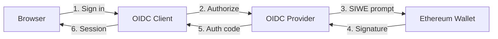

# @signinwithethereum/oidc-client

An OpenID Connect client that authenticates users with their Ethereum wallets via [Sign-In with Ethereum (SIWE)](https://siwe.xyz).

Designed to work with [`@signinwithethereum/oidc-provider`](https://github.com/signinwithethereum/oidc-provider) as the identity provider.

## How it works



1. User clicks **Sign in with Ethereum**
2. Client redirects to the OIDC provider's authorization endpoint (with PKCE)
3. Provider prompts the user to sign a SIWE message with their wallet
4. Wallet returns the cryptographic signature
5. Provider verifies the signature, issues an authorization code
6. Client exchanges the code for tokens and creates a session

The client uses [dynamic client registration](https://openid.net/specs/openid-connect-registration-1_0.html) to automatically register itself with the provider on first use.

## Setup

```bash
pnpm install
```

Copy the example environment file and configure it:

```bash
cp .env.example .env
```

### Environment variables

| Variable                 | Description                                         | Default                                   |
| ------------------------ | --------------------------------------------------- | ----------------------------------------- |
| `NUXT_SESSION_SECRET`    | Encryption key for session cookies (min 32 chars)   |                                           |
| `NUXT_OIDC_ISSUER`       | URL of the OIDC provider                            | `http://localhost:3000`                   |
| `NUXT_OIDC_REDIRECT_URI` | OAuth callback URL                                  | `http://localhost:3001/api/auth/callback` |
| `NUXT_OIDC_SCOPE`        | Requested OIDC scopes                               | `openid profile`                          |
| `NUXT_OIDC_CLIENT_NAME`  | Display name shown on the provider's consent screen | `Example OIDC Client`                     |
| `NUXT_OIDC_CLIENT_URI`   | Client homepage URL                                 | `http://localhost:3001`                   |
| `NUXT_OIDC_LOGO_URI`     | Client logo URL                                     | `http://localhost:3001/client-logo.png`   |
| `NUXT_OIDC_POLICY_URI`   | Privacy policy URL                                  |                                           |
| `NUXT_OIDC_TOS_URI`      | Terms of service URL                                |                                           |
| `NUXT_OIDC_CONTACTS`     | Admin contact emails (comma-separated)              |                                           |

`NUXT_OIDC_CLIENT_ID` and `NUXT_OIDC_CLIENT_SECRET` are optional -- the client registers itself automatically via the provider's registration endpoint.

## Development

Start the OIDC provider first (defaults to port 3000), then:

```bash
pnpm dev
```

The client runs on [http://localhost:3001](http://localhost:3001).

## Production

```bash
pnpm build
node .output/server/index.mjs
```

## Project structure

```
app/
├── pages/
│   ├── index.vue          # Login page
│   ├── dashboard.vue      # Protected user profile
│   ├── privacy.vue        # Privacy policy
│   └── terms.vue          # Terms of service
├── composables/
│   └── useAuth.ts         # Auth state & methods (login, logout, fetchUser)
└── middleware/
    └── auth.ts            # Route guard for protected pages

server/
├── api/auth/
│   ├── login.get.ts       # Initiates OIDC authorization flow
│   ├── callback.get.ts    # Handles provider redirect with auth code
│   ├── me.get.ts          # Returns current user from session
│   └── logout.get.ts      # Clears session & calls provider logout
└── utils/
    ├── oidc.ts            # Provider discovery (.well-known)
    ├── registration.ts    # Dynamic client registration
    ├── session.ts         # Encrypted cookie sessions
    └── lazy-singleton.ts  # Deduplicates async initialization
```

## Security

- **PKCE** (S256) for the authorization code exchange
- **State parameter** for CSRF protection
- **Encrypted sessions** via `NUXT_SESSION_SECRET`
- **Public client** (`token_endpoint_auth_method: none`) -- no client secret stored

## License

[MIT](./LICENSE) -- Copyright (c) 2026 EthID.org
